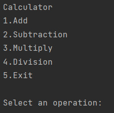

# Finalidad del archivo Calculator.java

Este archivo tiene como finalidad realizar un codigo
que actue como una calculadora (ya que solo 
incluye adición, sustracción, multiplicación y división
de dos números) para uso de operaciones matematicas 
sencillas de dos números.

## Explicación del archivo Calculator.java

Se empiza trabajando con un While para que el usuario
realice operaciones de dos numeros cuantas veces
quiera. 

Dentro del bucle While le mostramos al usuario 
las opciones que puede elegir para realizar 
operaciones.

La opción que elija el usuario la guardamos en 
una variable llamada "operation".Después tenemos
un condicional "if" con la condición de que la 
variable "operation" cumpla con algun número
de las opciones mostradas.(1,2,3,4 o 5).

En caso de que pase por el lado verdadero del if
le pediremos al usuario los dos números que
necesitamos para realizar operaciones.

Teniendo estos datos utilizamos un switch que
revisa el número que tiene la variable "operation"
y según este número se realiza la operación 
correspondiente(1-Add, 2-Substraction, 3-Multiply,
4-Division) para después mostrar el resultado al 
usuario.

Luego de esto tenemos un else if que se asegura
de recibir el valor 5 en la variable "operation"
para mostrar en pantalla un mensaje de despedida 
y salir del bucle While.

Por el lado falso(else) se mostrará un mensaje
diciendole al usuario que introduzca un número 
correcto según los mostrados al inicio del codigo, esto 
en caso de que el usuario haya elegido un número mayor a 5 
o menor a 1.

